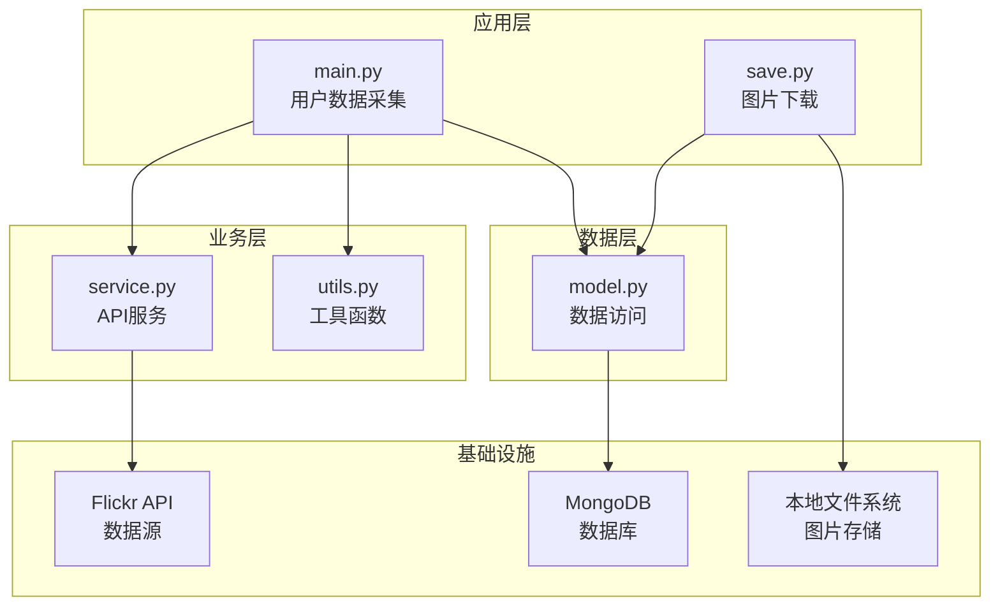

# Flickr爬虫项目

## 项目概述

Flickr爬虫是一个基于Python的分布式数据采集系统，专门用于从Flickr网站抓取用户信息、照片数据和社交关系。该系统采用现代化的模块化设计，通过多线程并发处理实现高效的数据采集和存储功能。

### 主要特性

- 🚀 **高性能多线程**：支持最大20个并发线程的用户数据采集
- 📊 **完整数据采集**：用户信息、联系人、群组、标签、收藏照片
- 🛡️ **健壮性设计**：完善的异常处理和错误恢复机制
- 💾 **数据持久化**：MongoDB存储 + 队列状态本地持久化
- 🔄 **断点续传**：支持中断恢复，自动保存采集进度
- 📝 **详细日志**：完整的日志记录和统计信息
- 🎯 **独立下载器**：独立的多线程图片下载模块

## 技术架构

### 技术栈

| 类别 | 技术 | 版本要求 | 用途 |
|------|------|----------|------|
| 编程语言 | Python | 3.7+ | 主要开发语言 |
| API客户端 | flickrapi | - | Flickr API交互 |
| 数据库 | MongoDB | 4.0+ | 数据存储 |
| 网络请求 | requests | - | HTTP请求处理 |
| 并发处理 | threading | - | 多线程管理 |
| 数据序列化 | json | - | 队列持久化 |

### 项目结构

```
flickr-spider/
├── main.py          # 主程序入口，多线程用户数据采集
├── service.py       # Flickr API服务封装层
├── model.py         # 数据访问层，MongoDB操作
├── utils.py         # 工具函数，队列和数据处理
├── save.py          # 图片下载器，独立运行程序
├── queue.json       # 队列状态持久化文件（运行时生成）
├── requirements.txt # 项目依赖
└── README.md        # 项目说明文档
```

### 架构设计



## 数据模型

### 用户信息结构

```json
{
  "nsid": "用户唯一标识符",
  "groups": ["用户加入的群组列表"],
  "tags": ["用户标签列表"],
  "photos": ["用户收藏的照片ID列表"],
  "contactors": {
    "family": ["家人联系人列表"],
    "friend": ["朋友联系人列表"],
    "public": ["公开联系人列表"]
  }
}
```

### 照片URL结构

```json
{
  "id": "照片唯一标识符",
  "image_url": "照片下载URL",
  "saved": 1  // 可选，下载状态标记
}
```

### 队列格式

```json
[1, "用户ID1", "用户ID2", "用户ID3", ...]
```

> 第一个元素为队头指针，后续元素为待处理的用户ID

## 安装与配置

### 环境要求

- Python 3.7+
- MongoDB 4.0+
- 网络连接（能够访问Flickr API）

### 安装步骤

1. **克隆项目**
   ```bash
   git clone <repository-url>
   cd flickr-spider
   ```

2. **安装依赖**
   ```bash
   pip install -r requirements.txt
   ```

3. **启动MongoDB**
   ```bash
   # Ubuntu/Debian
   sudo systemctl start mongod
   
   # macOS (使用homebrew)
   brew services start mongodb-community
   
   # Windows
   net start MongoDB
   ```

4. **配置Flickr API**
   - 访问 [Flickr API Keys](https://www.flickr.com/services/api/misc.api_keys.html)
   - 申请API Key和Secret
   - 修改 `service.py` 中的API密钥（可选，有默认测试密钥）

### 配置文件

可以通过修改各模块中的配置参数来自定义行为：

- **数据库配置**：`model.py` 中的 `DatabaseManager` 类
- **API配置**：`service.py` 中的 `FlickrService` 类
- **线程配置**：`main.py` 和 `save.py` 中的 `max_threads` 参数
- **下载路径**：`save.py` 中的 `save_path` 参数

## 使用指南

### 初始化队列

首次运行前需要创建初始用户队列文件 `queue.json`：

```json
[1, "128950283@N02", "128161560@N07", "127180464@N07", "61500992@N03", "44542478@N03"]
```

> - 第一个数字 `1` 是队头指针
> - 后续是初始用户ID列表
> - 用户ID可以从Flickr用户主页URL获取

### 运行数据采集

```bash
# 启动用户数据采集
python main.py
```

第一次运行时会提示进行OAuth认证：
1. 程序会输出认证URL
2. 在浏览器中打开该URL并授权
3. 将获得的验证码输入到程序中

### 运行图片下载

```bash
# 使用默认路径 ./flickr_images
python save.py

# 指定自定义保存路径
python save.py /path/to/save/images
```

### 监控运行状态

- **日志文件**：
  - `flickr_spider.log` - 用户数据采集日志
  - `photo_downloader.log` - 图片下载日志
  
- **实时统计**：程序运行时会输出实时进度和统计信息

- **数据库查询**：
  ```javascript
  // 连接MongoDB查看统计
  use flickr
  
  // 查看用户数量
  db.userInfo.count()
  
  // 查看照片数量
  db.photoUrl.count()
  
  // 查看已下载照片数量
  db.photoUrl.count({"saved": 1})
  ```

## 运行模式

### 1. 数据采集模式
运行 `main.py` 进行用户数据采集：
- 多线程并发处理用户队列
- 采集用户信息、联系人、群组、标签、收藏照片
- 自动保存队列状态，支持断点续传
- 完善的错误处理和重试机制

### 2. 图片下载模式
运行 `save.py` 进行图片批量下载：
- 从数据库获取未下载的照片URL
- 多线程并发下载到本地存储
- 自动更新下载状态
- 支持下载中断和恢复

### 3. 混合模式
两个程序可以同时运行：
- `main.py` 持续采集用户数据
- `save.py` 持续下载新增照片
- 通过数据库实现数据同步

## 性能优化

### 并发优化
- 合理设置线程数量（默认20个）
- 线程安全的数据共享机制
- 避免过度竞争的锁设计

### 数据库优化
- 使用索引优化查询性能
- 批量插入减少数据库连接开销
- 连接池管理数据库资源

### 网络优化
- 设置合理的请求超时时间
- 实现重试机制和错误恢复
- 使用Session复用连接

## 故障排除

### 常见问题

1. **SSL证书错误**
   ```bash
   # 设置证书路径（适用于代理用户）
   export REQUESTS_CA_BUNDLE=/path/to/certificate.crt
   ```

2. **MongoDB连接失败**
   - 检查MongoDB服务是否启动
   - 确认连接参数和权限设置
   - 查看防火墙设置

3. **Flickr API限制**
   - 检查API密钥有效性
   - 注意API调用频率限制
   - 确保网络能够访问Flickr

4. **内存使用过高**
   - 减少并发线程数
   - 调整批处理大小
   - 检查是否有内存泄漏

### 调试模式

修改日志级别以获取更详细的调试信息：

```python
# 在各模块顶部修改日志级别
logging.basicConfig(level=logging.DEBUG)
```

## 扩展开发

### 添加新的数据采集

1. 在 `service.py` 中添加新的API调用方法
2. 在 `model.py` 中添加相应的数据存储方法
3. 在 `main.py` 中集成新的采集逻辑

### 自定义数据处理

1. 在 `utils.py` 中添加数据处理函数
2. 在相应的采集流程中调用处理函数
3. 根据需要调整数据模型结构

### 配置管理

建议创建配置文件来管理各种参数：

```python
# config.py
CONFIG = {
    'mongodb': {
        'host': 'localhost',
        'port': 27017,
        'db_name': 'flickr'
    },
    'flickr': {
        'api_key': 'your_api_key',
        'api_secret': 'your_api_secret'
    },
    'threading': {
        'max_threads': 20
    },
    'download': {
        'save_path': './flickr_images',
        'batch_size': 400
    }
}
```

## 许可证

本项目遵循开源许可证，详情请参阅 LICENSE 文件。

## 贡献指南

欢迎提交Issue和Pull Request来改进项目：

1. Fork本项目
2. 创建特性分支
3. 提交更改
4. 推送到分支
5. 创建Pull Request

## 更新日志

### v2.0.0 (当前版本)
- ✨ 重构为Python 3.7+兼容
- 🔧 改进错误处理和日志系统
- 🚀 优化多线程性能
- 📊 添加详细统计信息
- 🛡️ 增强数据验证和完整性检查
- 📝 完善文档和注释

### v1.0.0 (原始版本)
- 基础的Flickr数据采集功能
- 简单的多线程实现
- MongoDB数据存储